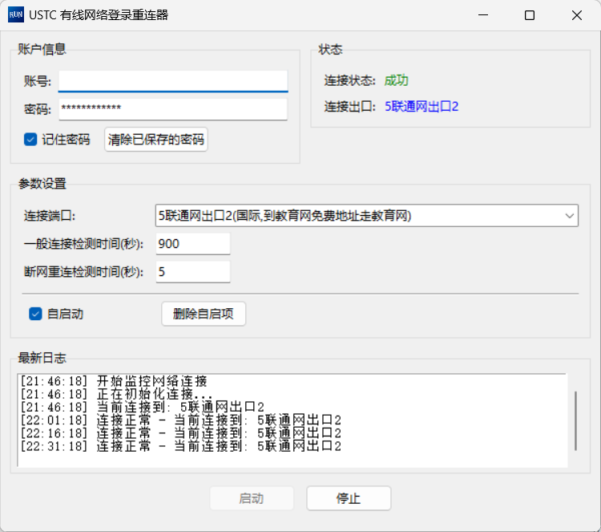

# ReUSTCNet - 中国科大有线网自动登录与断线重连工具

[](LICENSE)

适用于 **中国科学技术大学（USTC）有线网络** [`wlt.ustc.edu.cn`](http://wlt.ustc.edu.cn) 的后台自动登录与网络保持工具。  
支持断线自动重连、开机自启、系统托盘运行，密码使用 Windows DPAPI 加密存储。

## 功能

- 自动登录并选择出口（教育网、电信、联通、移动等）
- 网络断开后自动重连，支持快速重试与常规检测双模式
- 图形界面（Tkinter），实时显示连接状态与当前出口
- 系统托盘图标，左键单击显示窗口，支持隐藏到后台
- 可自定义检测间隔、出口类型、是否开机自启
- 密码使用 Windows 数据保护 API (DPAPI) 加密存储，仅当前用户可解密
- 一键清除已保存密码或删除开机自启注册表项
- 单文件 EXE 发布，无需安装 Python 环境

## 截图



## 使用方式

### 直接运行（已打包）

从 [Releases](https://github.com/distanrive/ReUSTCNet/releases) 页面下载最新的 `reustcnet.exe`，双击运行。  
首次使用需输入账号密码，勾选“记住密码”后会自动加密保存。

> **注意**：如果 Windows 弹出“Windows 保护了你的电脑”，请点击“更多信息” -> “仍要运行”。

### 从源码运行

```bash
# 克隆仓库
git clone https://github.com/distanrive/ReUSTCNet.git
cd ReUSTCNet

# 安装依赖
pip install requests pystray pillow

# 运行
python main.py
```

## 打包

项目提供了 `build.bat` 一键打包脚本，依赖：

- Python 3.12+（推荐使用 Anaconda 或标准 Python）
- [UPX](https://upx.github.io/)（可选，用于压缩体积）
- 一个自定义图标文件 `icon.ico`（可选）

### 打包步骤

1. **编辑 `build_config.bat`**，按实际环境修改以下路径：

   ```batch
   :: Python 解释器路径
   set "PYTHON_EXE=C:\ProgramData\anaconda3\python.exe"
   :: UPX 目录（不需要则留空）
   set "UPX_DIR=D:\tools\upx-5.2.0-win64\upx"
   :: Anaconda 的 Library\bin 目录（标准 Python 用户可留空）
   set "ANACONDA_LIB_BIN=C:\ProgramData\anaconda3\Library\bin"
   :: 程序图标（可选，留空则不使用自定义图标）
   set "ICON_FILE=icon.ico"
   ```

2. **将你的 `icon.ico` 放入项目根目录**（如果使用自定义图标）。

3. **双击 `build.bat`**，等待片刻。生成的 `dist\reustcnet.exe` 即为单文件程序。

> 打包过程中会自动创建一个临时虚拟环境，结束后自动清理，不会影响系统 Python 环境。

## 配置说明

配置文件 `config.json` 自动保存在程序所在目录，格式如下：

```json
{
  "username": "your_account",
  "password": "enc:ABCDEFG...",
  "export_type": "0",
  "fast_retry_interval": 60,
  "normal_check_interval": 900,
  "auto_start": false
}
```

| 字段                    | 说明                                                         |
| ----------------------- | ------------------------------------------------------------ |
| `username`              | 校园网账号                                                   |
| `password`              | 加密后的密码（运行时会解密使用）                             |
| `export_type`           | 出口编号：0-教育网出口, 1-电信网出口, 2-联通网出口, 3-电信网出口2, 4-联通网出口2, 5-电信网出口3, 6-联通网出口3, 7-教育网出口2, 8-移动网出口 |
| `fast_retry_interval`   | 断网时快速重试的间隔（秒）                                   |
| `normal_check_interval` | 正常联网时检测间隔（秒）                                     |
| `auto_start`            | 是否启用自启动（程序启动后自动开始监控，并在注册表添加开机自启） |

## 密码安全

- 密码使用 **Windows DPAPI**（数据保护 API）加密，密钥与当前 Windows 用户账户绑定。
- 密文存储在 `config.json` 中，即使文件泄露，也无法在其他用户或不同机器上解密。
- 程序运行时会在内存中短暂保存明文密码用于登录，但绝不会记录到日志文件或显示在界面上。
- 点击“清除已保存的密码”按钮可彻底删除配置文件中的密码。

## 工作原理

1. 程序启动后，若“自启动”选项开启且账号密码已设置，则自动开始监控。
2. 首次连接会依次完成：获取本机 IP → 登录 → 开通网络（选择出口）。
3. 联网成功后进入常规检测模式（默认每 900 秒检查一次），检测方式为读取 `http://wlt.ustc.edu.cn/cgi-bin/ip?cmd=disp` 页面，并检查是否包含 `权限: 国际`。
4. 若检测到断网，立即尝试重连，并切换为快速重试模式（默认每 60 秒一次），直到恢复连接。
5. 所有连接操作复用同一个 Session，减少不必要的登录请求。

## 关于适配其他学校

此工具主要针对 USTC 网络环境，但可以通过修改 `main.py` 中的 `NetworkManager` 类来适配其他校园网。  
需抓取并修改以下内容（使用浏览器 F12 开发者工具）：

| 项目                   | 说明                                                         |
| ---------------------- | ------------------------------------------------------------ |
| **登录 URL**           | POST/GET 地址及参数（如 `cmd=login`, `username`, `password`, `ip` 等） |
| **开通网络 URL**       | 选择出口的地址及参数（如 `cmd=set`, `type`, `exp`）          |
| **成功判断文本**       | 登录成功/开通成功后页面出现的标志性文字（如“登录成功”、“权限: 国际”） |
| **网络状态检测**       | 检测页面 URL 及关键字（如“权限: 国际”），或改用外部网站测试连通性 |
| **IP 提取正则**        | 从页面中提取本机 IP 的正则表达式                             |
| **页面编码**           | 响应编码（一般为 `gb2312` 或 `utf-8`，可在 `set_gb2312_encoding` 中修改） |
| **CSRF Token**（如有） | 某些系统需先获取 Token 才能登录，可增加预请求逻辑            |

欢迎提交 PR 增加其他学校的适配分支或配置文件。

## 开源许可

本项目采用 [MIT License](LICENSE)，允许自由使用、修改和分发，详见 LICENSE 文件。

## 贡献

欢迎提交 Issue 或 Pull Request。你可以：

- 报告 Bug 或提出新功能建议
- 为其他学校编写适配配置
- 改进 UI 或优化性能

## 致谢

- [pystray](https://github.com/moses-palmer/pystray) - 系统托盘支持
- [Pillow](https://python-pillow.org/) - 图像处理
- [PyInstaller](https://pyinstaller.org/) - 程序打包