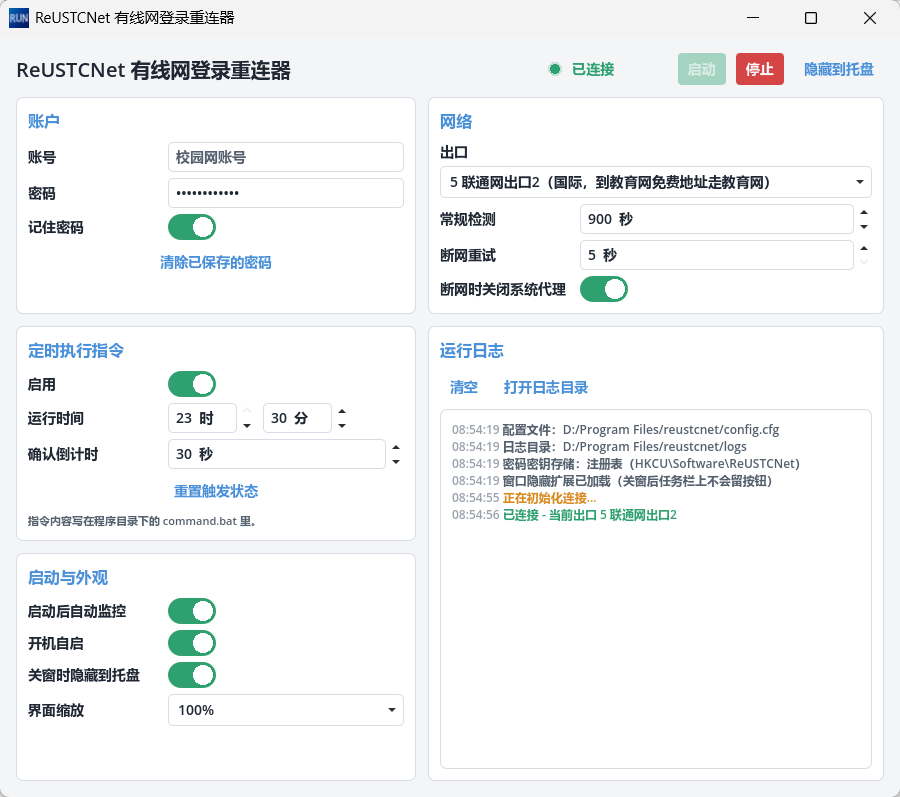

<p align="center">
  
</p>

<h1 align="center">ReUSTCNet — 中国科大有线网自动登录与断线重连工具</h1>

<p align="center">
  <a href="LICENSE"></a>
</p>

适用于 **中国科学技术大学（USTC）有线网络** [`wlt.ustc.edu.cn`](http://wlt.ustc.edu.cn) 的后台自动登录与网络保持工具。
支持断线自动重连、开机自启、系统托盘运行，密码加密存储。

界面用 **Godot 4.7**（纯 GDScript，无 Python 运行时）实现，用一套集中管理的设计令牌（`scripts/theme/theme_palette.gd`）
驱动全局样式 —— 颜色、字号、圆角、间距改一处即全界面生效。

## 截图



## 功能

- 自动登录并选择出口（教育网、电信、联通、移动等 9 个出口）
- 网络断开后自动重连，支持快速重试与常规检测双模式
- 实时显示连接状态、目标出口、本机 IP、连续运行时长、最后检测结果
- 系统托盘图标：关闭窗口时**从任务栏上收起来**（不是最小化），托盘菜单可显示主界面 / 启停监控 / 退出
- 断网时自动关闭 Windows 系统代理（可选开关）
- 密码用 AES-256 加密存储，密钥绑定当前 Windows 用户（见下方「密码安全」）
- 一键清除已保存的密码、或关掉开机自启
- 定时执行指令：到达设定时间后弹出确认倒计时，倒计时结束执行程序目录下的 `command.bat`
- 单实例运行；重复启动会把已有窗口叫到前台
- 界面缩放手动档位（跟随系统 / 100%～200%），记在配置里
- 运行日志可回看、可选中复制，自动跟随最新一行；另有按天轮转的日志文件

> **开机自启用的是「启动」文件夹里的快捷方式**，不是注册表
> （`%APPDATA%\Microsoft\Windows\Start Menu\Programs\Startup\ReUSTCNet.lnk`）。
> 往 `HKCU\...\Run` 写值会被杀软当成木马行为拦下来，所以没走那条路。
> **开关默认是关的**，程序不会自己打开它；从 1.x 升上来的话，旧的那条注册表项会在
> 第一次启动时被静默清掉，要自启请自己在「启动与外观」里勾一次。

## 使用方式

### 直接运行（已打包）

从 [Releases](https://github.com/distanrive/ReUSTCNet/releases) 页面下载最新的 `reustcnet.exe`，双击运行。
首次使用需输入账号密码，勾选「记住密码」后会自动加密保存。

> **注意**：如果 Windows 弹出「Windows 保护了你的电脑」，请点击「更多信息」→「仍要运行」。

### 从源码运行

需要 **Godot 4.7.x 标准版**（GDScript，非 .NET）。用 Godot 打开本目录，按 **F5** 运行即可，没有任何其他依赖。

```bash
godot --path . --quit-after 120          # 无人值守跑一遍，看有无报错
godot --path .                           # 正常打开界面
godot --path . -- --ui-scale=1.5         # 临时指定界面缩放
```

### 自检

平台相关的部分（编码解码、表单编码、密码加解密、注册表读写、自启快捷方式）、
两个「错了也不报错」的界面控件（滚动条宽度、日志控件的裁剪与转义），
以及那个原生窗口扩展（能不能加载、隐藏是不是真的生效）有一份自检，
改动这几处之后跑一下：

```bash
godot --headless --path . --script res://tools/self_check.gd

# 原生扩展那一项要在**窗口模式**下才会真跑（headless 下没有窗口系统，会跳过）：
godot --path . --script res://tools/self_check.gd
```

它只碰本程序自己的注册表键（`HKCU\Software\ReUSTCNet*`），跑完清理干净，
**不会动你的系统代理或任何其他设置**。开机自启那一项会建一个快捷方式再立刻删掉、
并把原来的状态还原（在编辑器里跑时整项跳过）；原生扩展那一项用的是**临时窗口**，
不会碰你的主窗口。退出码 0 = 全通过。

> 这是**开发期工具**，需要 Godot 本体才能运行；导出的 exe 里不带它
> （发布版模板不会执行 `--script` 指定的脚本，带上也是死重量）。

### 定时执行指令

1. 在界面「定时执行指令」卡片里勾选「启用」，设置**运行时间**（24 小时制）与**确认倒计时**（秒）。
2. 在程序目录下新建 `command.bat`，写入需要定时执行的指令，例如：

   ```batch
   @echo off
   shutdown /s /t 0
   ```

3. 到达设定时间后弹出确认倒计时窗口，环形进度条走完（或长按「立即执行」1 秒）后执行 `command.bat`。
4. 若触发时程序目录下不存在 `command.bat`，会提示并跳过本次执行。
5. 同一分钟只触发一次；**点「取消」不算已触发**，当天还能再响，也可以点「重置触发状态」手动清掉记录。

> 「立即执行」是长按按钮，需要按住 1 秒才触发 —— `command.bat` 里通常写的是不可撤销的指令，
> 误点一次代价太大。

## 配置说明

配置**默认写在程序所在目录**（绿色版；开发期就是工程目录）。若该目录不可写（例如装在
`C:\Program Files` 下），会自动退到 `%APPDATA%\Godot\app_userdata\ReUSTCNet\`，
并在启动日志里明确提示。界面日志区的头几行会打印实际使用的路径。

配置文件是 Godot 的 `ConfigFile` 格式（`config.cfg`），业务字段在 `[app]` 段：

| 字段 | 说明 |
| --- | --- |
| `username` | 校园网账号 |
| `password` | 加密后的密码（`enc:` 前缀 + base64；运行时解密使用） |
| `export_type` | 出口编号：0-教育网出口, 1-电信网出口, 2-联通网出口, 3-电信网出口2, 4-联通网出口2, 5-电信网出口3, 6-联通网出口3, 7-教育网出口2, 8-移动网出口 |
| `fast_retry_interval` | 断网时快速重试的间隔（秒，默认 60） |
| `normal_check_interval` | 正常联网时检测间隔（秒，默认 900） |
| `remember_password` | 是否把密码写进配置文件（关闭时密码只在本次运行期间保留） |
| `auto_close_proxy` | 是否在断网时自动关闭 Windows 系统代理 |
| `auto_command` | 是否启用定时执行指令 |
| `command_hour` / `command_minute` | 指令运行时间（24 小时制） |
| `command_countdown` | 执行前的确认倒计时（秒） |
| `command_last_triggered` | 上次**已执行**的时刻（`YYYY-MM-DD HH:MM`），用于防止重启后同一分钟重复触发 |
| `auto_start_monitor` | 程序启动后是否自动开始监控 |
| `minimize_to_tray` | 关闭窗口时是否隐藏到托盘（关掉则点关闭直接退出） |

同一文件里还有 `[ui]`（界面缩放）与 `[window]`（窗口尺寸/最大化）两个段，由 `AppShell` 维护。

### 从旧版 Python 程序迁移

首次运行时会自动读取程序目录下的旧 `config.json`，导入其中的**非密码**字段，
并把文件改名为 `config.json.imported`（不删除，方便你回头查看）。

**密码导不过来**：旧版存的是 Windows DPAPI 密文，程序解不开，需要重新输入一次。
导入这件事会在界面上明确提示，不会静默丢掉。

## 密码安全

- 密码用 **AES-256-CBC** 加密后存进配置文件，每份密文带一个随机 IV。
- 加密密钥是一串 32 字节随机数，第一次运行时生成后存在
  `HKCU\Software\ReUSTCNet`（**只当前用户可读**）。
- 所以：**配置文件被单独拷走（备份、同步到网盘、发给别人）也解不出密码** ——
  密钥不在文件里，在你这台机器的注册表里。
- 程序运行时会在内存中短暂保存明文密码用于登录，但不会记录到日志文件或显示在界面上。
- 点「清除已保存的密码」可彻底删除配置文件里的密码。

> **和旧版 DPAPI 的差别，如实说明**：能读到你当前 Windows 账户注册表的人，
> 密钥和密文就一起拿到了。DPAPI 多一层「密钥绑在用户 master key 上」的保护 —— 这一层这里没有。
> 也就是说：**登录了你的 Windows 账户的攻击者，两种方案都挡不住**；
> 区别只在「配置文件单独泄漏」这一种情况下，而那种情况两者都防得住。
>
> 若注册表不可写（组策略、权限受限），密钥会**降级**成程序目录下的 `.key` 文件
> （安全性低于注册表），此时启动日志里会有一行明确的警告，不会静默降级。

## 工作原理

1. 程序启动后，若「启动后自动监控」已开启且账号密码已填，则自动开始监控。
2. 首次连接依次完成：读取本机 IP → （必要时）登录 → 开通网络（选择出口）。
3. 联网成功后进入常规检测模式（默认每 900 秒一次）：读取 `http://wlt.ustc.edu.cn/cgi-bin/ip?cmd=disp`，
   检查页面是否包含 `权限: 国际`。
4. 检测到断网则立即重连，并切换为快速重试模式（默认每 60 秒一次），直到恢复。
5. 监控循环是**主线程上的一条协程**（`scripts/core/net_monitor.gd`），
   靠 `await` 等 HTTP 与计时器，没有后台线程 —— 所以「停止」能在 0.25 秒内真正停下来。

### 中文页面的编码

`wlt.ustc.edu.cn` 的响应头是 `Content-Type: text/html`，**不带 charset**，页面里写着 `charset=gb2312`。
所有「是否登录成功 / 出口是否开通」的判据都是中文串比对，编码一旦解错，判据会**静默失效**
（表现为「网络明明是好的却一直报断网」）。处理顺序（`scripts/core/wlt_client.gd` 的 `decode_body`）：

1. 页面声明的 charset 是权威依据 —— 但 Windows 上只有编码名 `gb2312` / `gb18030` 有效，
   `936` / `GBK` / `cp936` 都会返回空串；
2. 字节本身是合法 UTF-8（且含多字节字符）就直接按 UTF-8 解 —— 这一条兜住「没声明」和「声明写错」；
3. 解出来出现替换字符（`�`）就换另一种再试。

这几条都有回归项，见 `tools/self_check.gd`。

## 目录结构

```
.
├── project.godot                 # 工程配置 + autoload（无后端，纯 GDScript）
├── native_window.gdextension     # 原生窗口扩展的清单（Godot 靠扫这个文件发现它）
├── scenes/app.tscn               # 主场景
├── scripts/
│   ├── app.gd                    # 主界面：建界面 / 绑定配置 / 接核心逻辑的信号
│   ├── autoload/
│   │   ├── theme_manager.gd      # 启动时构建并应用全局主题
│   │   ├── app_shell.gd          # 窗口尺寸、DPI 缩放、配置落盘位置
│   │   ├── app_config.gd         # 业务配置读写 + 旧版 config.json 导入
│   │   └── instance_guard.gd     # 单实例 + 唤起已有窗口
│   ├── theme/
│   │   ├── theme_palette.gd      # 设计令牌（颜色/圆角/字号/间距，唯一可调来源）
│   │   └── theme_factory.gd      # 由令牌构建完整 Theme
│   ├── ui/                       # 可复用控件（StatusDot / Switch / TitledGroup / LogView / …）
│   └── core/                     # 纯逻辑，不引用任何 UI
│       ├── wlt_client.gd         # 取 IP / 登录 / 开通出口 / 检测 + 响应解码
│       ├── net_monitor.gd        # 监控状态机（协程）
│       ├── app_paths.gd          # 可写目录探测、日志目录、command.bat 查找
│       ├── secret_store.gd       # 密码加解密
│       ├── win_registry.gd       # 注册表读写（reg.exe）
│       ├── win_system.gd         # 开机自启（启动文件夹快捷方式）、系统代理开关
│       ├── win_shell.gd          # 起进程（含 PowerShell）
│       ├── command_scheduler.gd  # 定时执行指令
│       └── log_store.gd          # 日志落盘 + 轮转 + 清理
├── themes/icons/                 # 控件图标
├── bin/                          # 原生扩展的产物（*.dll，构建时生成）
├── tools/
│   ├── self_check.gd             # 平台相关部分的自检
│   ├── build_native_window.sh    # 编译原生窗口扩展
│   └── native_window/            # 那个扩展的 C 源码（为什么需要它，见源码顶部注释）
├── docs/code-review.md           # 旧版 main.py 的审阅记录
├── oldversion/                   # 旧版 Python 实现（本地存档，见下）
└── README.assets/                # 截图
```

> `oldversion/` 被 `.gitignore` 排除，是**本地存档**：旧版代码不在仓库里，
> 但仍保存在 git 历史中（`git show <旧提交>:main.py` 可取回）。
> 想让它们进仓库，把 `.gitignore` 里那一行删掉即可。

## 打包

一键脚本：

```bat
build.bat              :: 导出 release + 冒烟测试 + 压 rar
build.bat debug        :: 导出 debug 版（带 console 包装，能看 print 输出）
build.bat run          :: 导出后直接启动 exe
build.bat test         :: 只导出 + 冒烟测试
build.bat templates    :: 列出已安装的导出模板（排查模板缺失）
```

配置在 `build_config.bat` 里（Godot 路径、预设名、是否压包、是否编原生扩展），换机器只改这一个文件。
导出流程是 5 步：查模板 → **编译原生窗口扩展** → 刷导入缓存 → 导出 → 冒烟测试。

**产物是三个文件，必须一起分发**：

| 文件 | 说明 | 缺了会怎样 |
| --- | --- | --- |
| `dist\ReUSTCNet.exe` | 引擎本体，约 34 MB（用的是自编译的精简模板，见下） | —— |
| `dist\ReUSTCNet.pck` | 本项目的全部数据，约 260 KB | **起不来** |
| `dist\native_window.windows.x86_64.dll` | 约 58 KB，让「关窗后从任务栏消失」成为可能 | 能起来，但关窗只会最小化（启动日志里有警告） |

`command.bat` 放在 exe 同级目录。目标机器**不需要装 Python、不需要任何运行时**。

那个 `.dll` 是本项目唯一一段非 GDScript 的代码，由 `tools/build_native_window.sh`
用 MinGW 的 gcc 编出来（要装一次 MinGW，见 CLAUDE.md；`build.bat` 会自动调它，
找不到 bash/gcc 时会警告并沿用已有的 dll）。它存在的原因写在
`tools/native_window/native_window.c` 顶部：**Godot 从设计上禁止隐藏主窗口**。

### 首次打包前要装导出模板

到 [Godot 下载页](https://godotengine.org/download/windows/) 下载与 Godot 版本对应的
**Export Templates**（约 800 MB 的 `.tpz`，其实就是个 zip），解压到：

```
%APPDATA%\Godot\export_templates\4.7.2.stable\
```

解压后该目录下应当**直接**是 `version.txt`、`windows_release_x86_64.exe` 等文件，
**不要再套一层 `templates\` 目录**（`.tpz` 里面自带这一层，要把它剥掉）。
拿不准就先跑 `build.bat templates` 看看认到了什么。

### 关于体积

exe 里那 100 MB 全是 Godot 引擎本身（本项目的全部数据只有 190 KB），
所以调资源、调导入设置都没用 —— 唯一的办法是**自己编译一个精简版引擎模板**。

本项目就是这么做的，官方模板 104 MB 压到了 **29.4 MB**：

| | 官方模板 | 精简模板 | 精简 + 类级裁剪（本项目） |
| --- | --- | --- | --- |
| exe | 104.1 MB | 32.8 MB | **29.4 MB** |
| rar 发布包 | 27.8 MB | 8.6 MB | **7.5 MB** |

分两级砍：

1. **关模块与引擎特性**（3D、音频、导航、XR、物理、纹理压缩编解码、各种图片格式、
   多人联机、SDL 手柄输入、废弃 API 兼容层……）。**保留** SVG（图标）、WebP（纹理导入内部用它）、
   高级文本服务器（中文排版）、glslang（着色器）、freetype、Vulkan + OpenGL 双渲染路径。
2. **类级裁剪** —— 用编辑器里「项目 → 工具 → Engine Compilation Configuration Editor →
   Detect from Project」生成一份 `.gdbuild`（本项目在 `tools/reustcnet.gdbuild`），
   把用不到的引擎类整个编掉。这一步能再省 7.8%。

重新编译的完整步骤、**每一次重新 Detect 之后必须核对的四条**、以及踩过的坑，
见 `CLAUDE.md` 的「打包 → 体积」一节。脚本是 `tools/build_template.sh`，
模板路径填在 `build_config.bat` 的 `CUSTOM_TEMPLATE`。
不想折腾也能用官方模板：把 `CUSTOM_TEMPLATE` 清空即可，`build.bat` 会照常工作（exe 变回 104 MB）。

## 关于适配其他学校

此工具针对 USTC 网络环境，但改 `scripts/core/wlt_client.gd` 即可适配其他校园网。
需抓取并修改以下内容（用浏览器 F12 开发者工具）：

| 项目 | 说明 |
| --- | --- |
| **登录 URL** | `BASE_URL`，以及 `login()` 里的 POST 参数（`cmd` / `name` / `password` / `ip` 等） |
| **开通网络 URL** | `activate()` 里的参数（`cmd=set` / `type` / `exp`） |
| **成功判断文本** | `MARK_*` 一组常量（如「登录成功」「权限: 国际」） |
| **网络状态检测** | `check_permission()` 的检测页面与关键字 |
| **IP 提取** | `_extract_ip()` |
| **页面编码** | `decode_body()` 里声明的 charset 分支 |
| **表单编码** | `_percent()`：本项目的站点是 GB2312 页面，表单参数按 GB2312 转义 |
| **CSRF Token**（如有） | 某些系统需先获取 Token 才能登录，可在 `_request()` 前加一次预请求 |

改完记得跑一遍自检（`tools/self_check.gd` 里的编解码期望值也要跟着改）。
欢迎提交 PR 增加其他学校的适配。

## 致谢

- [Godot Engine](https://godotengine.org/) — 界面与运行时（MIT）
- 控件的交互设计参考了 PyQt-SiliconUI 的形态；本项目只借鉴交互，代码全部新写

## 开源许可

本项目采用 [MIT License](LICENSE)，允许自由使用、修改和分发，详见 LICENSE 文件。
